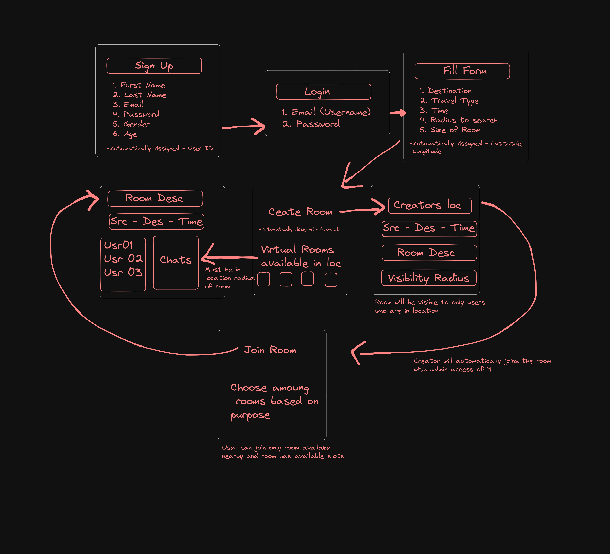

# HeadTogether
### This Project has been completely made form scratch from the starting of the hackathon
Our project, HeadTogether is a travel companion app tailored for travelers. With our app, users can input their personal information and specify their travel intentions, whether it's exploring a new destination, sharing a cab ride, or enjoying a movie with someone. With HeadTogether, you can create and join exclusive "rooms" for specific purposes within a a specified radius, making your immediate location your password. Upon submission, our app will generate a virtual "room" based on these details, allowing users to define the room's size and set the range for visibility to others. This unique room concept is then made accessible to fellow app users within the specified range. They can explore these rooms, join discussions, and collaborate on travel plans, fostering connections and making solo adventures more engaging and social.  It's all about local synergy, where your neighbors, fellow commuters, or enthusiasts in your area can easily connect, share rides, play sports, or embark on shared activities, all by being in the right place at the right time. Whether you're seeking companionship, ride-sharing, or cultural exploration, our travel app has you covered. 

## Flow Diagram

## Database Diagram


## Tech Stack
### Frontend 
#### Capacitor (Ionic)
Capacitor allows you to convert your web app (built with React) into a native app, which is crucial for creating a mobile travel companion application. It bridges the gap between web and native development.

#### React
React is a popular and efficient JavaScript library for building user interfaces. It provides a responsive and interactive front end for your app.

#### TypeScript
TypeScript is a statically typed superset of JavaScript that helps catch type-related errors early in development, enhancing code quality and maintainability.

#### ReactQuery
ReactQuery is a library that simplifies data fetching and state management in React applications. It can improve the performance and maintainability of your app by handling data retrieval and caching.

#### ReactRouter
ReactRouter is used for managing the routing and navigation within your React application, ensuring a smooth and organized user experience.

#### Android SDK
This is essential for building Android applications. It provides the tools, libraries, and APIs necessary for developing Android apps.

### Backend 
#### FASTApi
FASTApi is a modern, fast (high-performance), web framework for building APIs with Python. It's suitable for creating the server-side logic and API endpoints for your app.
Before running the application, you need to install the required dependencies. You can do this using `pip`.

### Database
#### Firebase 
Firebase offers real-time database and authentication services, making it an excellent choice for a travel companion app that requires features like user authentication, real-time updates, and data storage. Used here for authentication

#### MySQL
MySQL is a relational database management system. It can be used to store structured data and ensure data consistency and integrity, which may be necessary for certain aspects of your application. Used here for user and room data management.

### Hosting
#### Render
Render is a cloud hosting platform that can host both frontend and backend applications. It offers scalability and ease of deployment, which is important for ensuring your app can handle varying levels of traffic. Used here to host FASTApi app.


## Getting Started
Before running the backend, make sure to install required dependencies.

```bash
pip install fastapi[all] aiomysql pyrebase4
```

## Running the Application

You can run the FastAPI application using the following command:

```bash
uvicorn main:app --host 0.0.0.0 --port 8000 --reload
```

This command starts the application on `http://localhost:8000`. You can access the API documentation at `http://localhost:8000/docs` or `http://localhost:8000/redoc`.

## Endpoints

### Authentication

#### Signup (POST `/signup`)

- Creates a new user account.
- Requires providing an email and password.
- Inserts user information into the MySQL database.

#### Login (POST `/login`)

- Authenticates a user and returns an access token.
- Requires providing a valid email and password.

#### Get User Info (GET `/get_user_info`)

- Retrieves user information based on the provided access token.
- Requires a valid access token obtained during login.

### Rooms

#### Create Room (POST `/create_room`)

- Creates a new room.
- Requires providing room details like `OwnerName`, `RoomPurpose`, `Latitude`, `Longitude`, and `DistanceAllowed`.
- The user who creates the room is automatically added as an admin of the room.

#### Get Room (GET `/get_room/{room_id}`)

- Retrieves room details based on the provided room ID.
- Requires a valid room ID.
- Accessible to authenticated users.

#### Search Nearby Rooms (GET `/search_nearby_rooms`)

- Searches for nearby rooms based on user's latitude and longitude.
- Requires providing the user's location (`user_latitude` and `user_longitude`).
- Returns a list of nearby rooms.

#### Join Room (POST `/join_room/{room_id}`)

- Allows a user to join an existing room.
- Requires providing a valid room ID.
- The user is added as a participant in the room.

### Messaging inside Rooms
#### Post Chat (POST `/post_chat`)

- Sends message to the designated room.

#### Get Chat (POST `/get_chats/{room_id}`)

- Gets chats from that particular room. Works in sync with post_chat.

- Sends message to the designated room.

## Database Configuration

The application uses MySQL for user and room data storage. Make sure to configure the MySQL database connection parameters in the `create_connection_pool` function.

## Firebase Configuration

Firebase is used for user authentication. You need to provide your Firebase configuration in the `config` dictionary. Update the `config` dictionary with your Firebase project credentials.

```python
config = {
    "apiKey": "your_api_key",
    "authDomain": "your_auth_domain",
    "projectId": "your_project_id",
    "storageBucket": "your_storage_bucket",
    "messagingSenderId": "your_messaging_sender_id",
    "appId": "your_app_id",
    "measurementId": "your_measurement_id",
    "databaseURL": "your_database_url"
}
```

## Dependencies

- FastAPI: A modern, fast web framework for building APIs with Python.
- pyrebase: A Python wrapper for the Firebase API.
- aiomysql: An asynchronous MySQL client for Python.

